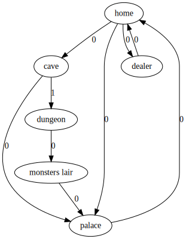
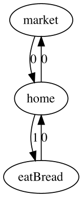

# Gulp

***Gulp*** - игровой движок для создания консольных текстовых квестов написанный на *Java/Kotlin*.
Весь сценарий игры описывается в удобном формате ```JSON```.

Игра представляется в виде ориентированного взвешенного графа. Игрок каждый момент игры находится в какой-то вершине графа с определенным состоянием инвентаря, и все действия игрока будут ребрами изменяющими инвентарь и нынешнюю вершину игрока.

У каждого ребра есть требования, которые обязательно должны быть удовлетворены для перехода по этому ребру. Среди доступных(если требовония учтены) ребер выбирается с самым большим приоритетом, если таких несколько игроку дается выбор.

<p align="center">
  
</p>


# Структура

## Scene

| Атрибуты     |        Тип          |             Описание                                     |
|:---------    |:--------------------|:---------------------------------------------------------|
|   text       | ```Text```          | Сообщение выводящееся на экран при перемещение на данную сцену.                                                                                          |
|   edges      | ```List<Edge>```    | Список всех возможных переходов из данной вершины.       |
| newItems     | ```Requirement```   | Словарь добавляемых в инвентарь предметов при посещении этой вершины. **Внимание!** Предметы добавляются сразу  *после* выхода из этой вершины.              |
## Edge
| Атрибуты     |        Тип          | Описание                                                 |
|:-------------|:--------------------|:---------------------------------------------------------|
|    text      |   ```Text```        | Сообщение выводящееся на экран, при выборе.              |
| nextScene    |   ```String```      | Название вершины в которую перейдет игрок при выборе данного ребра.                                                                                          |
| requirements |   ```Requirement``` | Требуемые для перехода в данную вершину предметы инвенторя.                                                                                      |
| priority     |  ```Long```         | Приоритет ребра.                                         |
## Requirement
Cловарь, где ключ является названием предмета, а значение количеством.
* ```Key``` - ```String```
* ```Value``` - ```Int```
## Text
Является списком объектов. Каждый объект имеет тип либо ```Message```, либо ```Option```.
### Message
| Атрибуты     |     Тип             |             Описание                                     |
|:-------------|:--------------------|:---------------------------------------------------------|
|     msg      | ```String```        | Текст сообщения                                          |
|   color      | ```String```        |  Цвет сообщения.  Все возможны цвета можете найти ниже в разделе **Color**                                                                               |
|    back      | ```String```        |Цвет фона сообщения. Может быть тех же цветов, что и color|
### Option
| Атрибуты     |        Тип          |             Описание                                     |
|:-------------|:--------------------|:---------------------------------------------------------|
| pause        |   ```Long```        |   Число милисекунд бездействия. В этот момент в игре ничего не происходит.                                                                                  |
| sound        |  ```String```       |  Путь к файлу звука. Аудио-файл обязан быть в формате WAV. Если в этот момент проигрывается другой файл, то он прервется и начнется новый.                                                                                          |


**Внимание!** Сначала начнет проигрываеться мелодия, и только потом начнется пауза.
### Color
Может быть выражен 8 цветами.
* ```Black```
* ```Red```
* ```Green```
* ```Yellow```
* ```Blue```
* ```Purple```
* ```Cyan```
* ```White```
## Game
Вся игра описывается, как словарь, где ключ это название вершины, а значение это сама сцена.
* ```Key``` - ```String```
* ```Value``` - ```Scene```
## Общая структура
В файле будет содержатся один словарь с двумя полями.
```game``` - являющийся ```Game```
begin - сцена с которой начинается игра.
# Установка и использование
В папке **source** есть искодный код на *Java/Kotlin*. В папке **program** лежит **gulp.jar** файл.
Его можно запустить через консоль командой:
```java -jar gulp.jar```
У вас должна быть версия **java 1.8** или выше.
В папке с **gulp.jar** обязательно должен быть файл ```Config.txt```
## Config
|   Поле               |  Описание                                          |
|----------------------|----------------------------------------------------|
|```[SOURCE_FILE]```   | Путь к ```JSON``` файлу с игрой                    |


## Запуск
После запуска **gulp.jar** запуститься сценарий написанный в ```[SOURCE_FILE]```.

# Debug
Для отладки программы вы можете использовать визуализатор графов. В папке **debug** вы можете найти визуализатор запускается также, как и основной движок. В ```Config.txt``` вы должны указать ```JSON``` файл сценария, файл куда поместится описание графа на языке **dot**, файл с изображением.

|   Поле               |  Описание                                          |
|----------------------|----------------------------------------------------|
|```[SOURCE_FILE]```   | Путь к ```JSON``` файлу с игрой                    |
|```[OUT_GV_FILE]```   | Путь в котором появится описание **dot**           |
|```[OUT_PNG_FILE]```  | Путь в котором появится изображение графа          |

Пример изображения на сценарий из примера *Life*.

<p align="center">
  
</p>

## Как это работает
У вас должен быть установлен **graphviz**. С его помощью граф превращается в язык **dot**. После из файла, он превращается в изображение.
